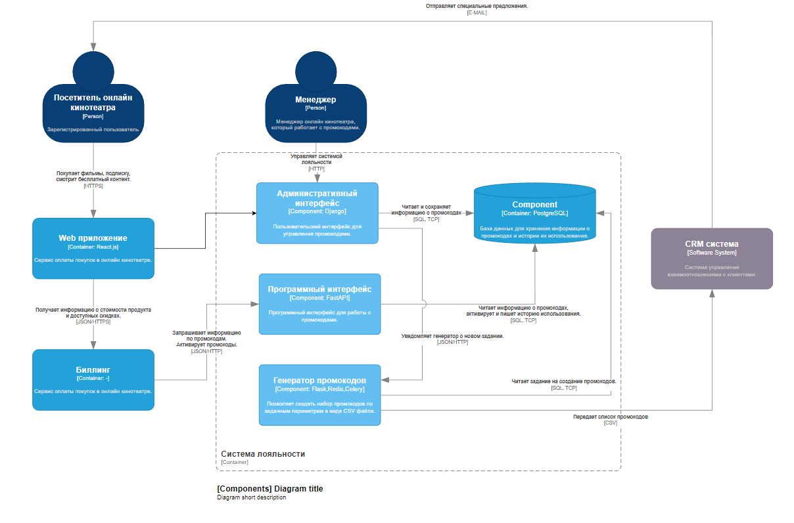
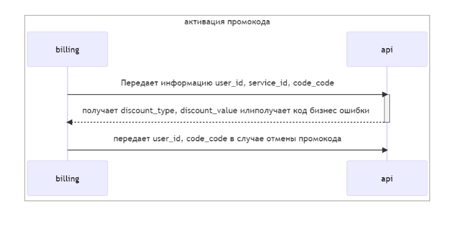
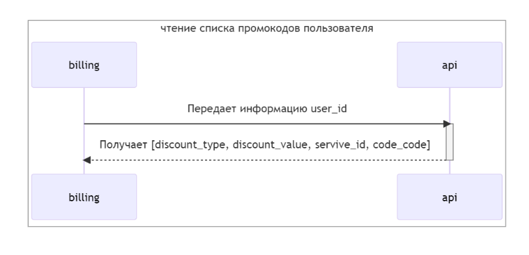

# Дипломный проект 20 когорты 

https://github.com/baramba/yap_graduate_work

## Тема
### Сервис лояльности онлайн кинотеатра

## Участники
* Антон Ревуцкий, backend
* Юрий Сухобок, backend
* Михаил Индуров, backend
* Бабихин Максим, frontend
  
  
## Запуск
1. Переименовать .env_example в .env
2. Запустить docker compose up -d
3. Демонстрационная страницы будет доступна по адресу http://localhost
4. Административная панель будет доступна по адресу http://localhost/admin

## Описание проекта

Сервис позволяет создавать промокоды различных типов для привлечения новых клиентов, удержания старых и повышения продаж.

